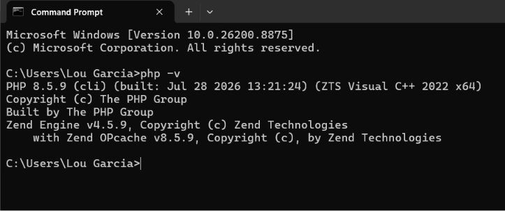
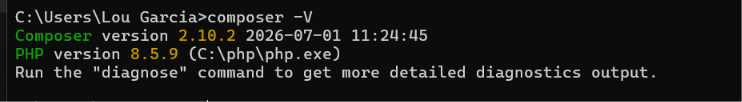
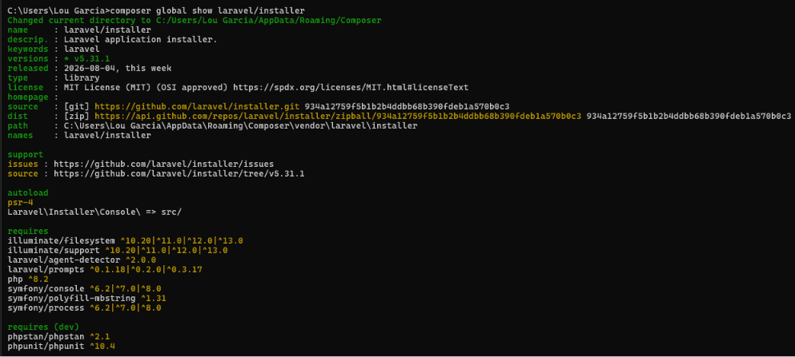
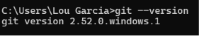
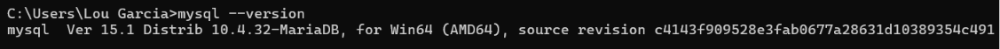
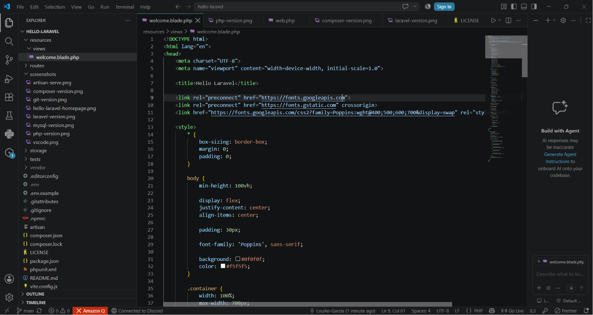
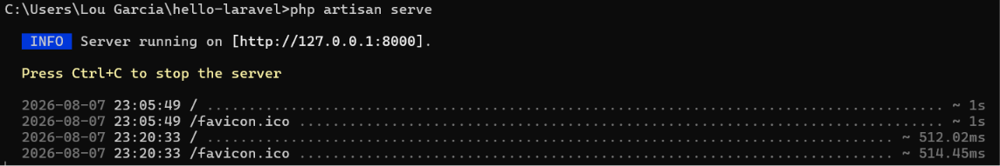
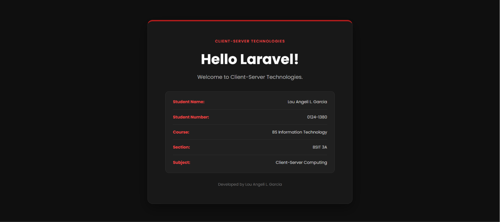

# Client-Server Week 02: Laravel Setup

  <strong>Laravel Development Environment Setup and Configuration</strong>

  
  
  

---

<h2 style="color:#6D28D9;"> 1. Project Title</h2>

<strong>Client-Server Week 02: Laravel Setup and Development Environment</strong>

---

<h2 style="color:#6D28D9;"> 2. Introduction</h2>

<h3>Brief Overview of Laravel</h3>

Laravel is a PHP web application framework designed to make web development more organized and efficient. It provides features and tools for routing, database management, application structure, and web application development.

<h3>Importance of Client-Server Technologies</h3>

Client-server technologies allow applications to communicate between a client and a server. The client sends requests, while the server processes those requests and returns the appropriate response. These technologies are important in developing modern web applications because they allow users to interact with applications and databases through a web browser.

<h3>Purpose of the Project</h3>

The purpose of this activity is to install and configure the necessary tools for Laravel development. It also aims to create a Laravel project, connect it to a MySQL database, run the Laravel development server, and become familiar with the basic Laravel project structure.

---

<h2 style="color:#6D28D9;"> 3. Objectives</h2>

At the end of the activity, the following objectives were achieved:

<ul>
  <li>Install and configure PHP for Laravel development.</li>
  <li>Install and configure Composer as the PHP dependency manager.</li>
  <li>Install and create a Laravel project using Composer.</li>
  <li>Configure MySQL/MariaDB using XAMPP.</li>
  <li>Connect the Laravel application to a MySQL database.</li>
  <li>Run database migrations using Laravel Artisan.</li>
  <li>Run the Laravel development server.</li>
  <li>Use Visual Studio Code as the development environment.</li>
  <li>Initialize and upload the Laravel project to a GitHub repository.</li>
</ul>

---

<h2 style="color:#6D28D9;"> 4. Development Environment</h2>

<table>
  <tr>
    <th>Component</th>
    <th>Version / Details</th>
  </tr>
  <tr>
    <td>Operating System</td>
    <td>Windows</td>
  </tr>
  <tr>
    <td>PHP</td>
    <td><i>v8.5.9</i></td>
  </tr>
  <tr>
    <td>Laravel</td>
    <td><i>v5.31.1</i></td>
  </tr>
  <tr>
    <td>Composer</td>
    <td><i>v2.10.2</i></td>
  </tr>
  <tr>
    <td>Git</td>
    <td><i>2.52.0</i></td>
  </tr>
  <tr>
    <td>MySQL / MariaDB</td>
    <td><i>v15.1</i></td>
  </tr>
  <tr>
    <td>Visual Studio Code</td>
    <td><i>v1.132.0</i></td>
  </tr>
</table>

---

<h2 style="color:#6D28D9;"> 5. Installation Steps</h2>

<h3>Step 1 — Install PHP</h3>

PHP was downloaded and extracted to:

<pre><code>C:\php</code></pre>

The PHP directory was added to the Windows PATH environment variable so that PHP commands could be executed from the terminal.

<pre><code>php -v</code></pre>

<strong> Screenshot:</strong> PHP version displayed in the terminal.

---

<h3>Step 2 — Configure PHP</h3>

The <code>php.ini-development</code> file was renamed to <code>php.ini</code>. Required PHP extensions were enabled to support Composer and Laravel.

Important extensions included:

<pre><code>zip
fileinfo
pdo_mysql
mysqli</code></pre>

---

<h3>Step 3 — Install Composer</h3>

Composer was installed to manage Laravel's PHP dependencies.

<pre><code>composer -V</code></pre>

<strong> Screenshot:</strong> Composer version displayed in the terminal.

---

<h3>Step 4 — Configure XAMPP and MySQL</h3>

XAMPP was used to provide the local database environment. The MySQL/MariaDB executable was located in:

<pre><code>C:\xampp\mysql\bin</code></pre>

The directory was added to the Windows PATH so that MySQL commands could be accessed from the terminal.

---

<h3>Step 5 — Create the Laravel Project</h3>

The Laravel project was created using Composer:

<pre><code>composer create-project laravel/laravel hello-laravel</code></pre>

The project was created in:

<pre><code>C:\Users\Lou Garcia\hello-laravel</code></pre>

---

<h3>Step 6 — Configure the Database</h3>

The Laravel <code>.env</code> file was configured to use MySQL:

<pre><code>DB_CONNECTION=mysql
DB_HOST=127.0.0.1
DB_PORT=3306
DB_DATABASE=hello_laravel
DB_USERNAME=root
DB_PASSWORD=</code></pre>

The <code>hello_laravel</code> database was created using the local MySQL/MariaDB environment.

---

<h3>Step 7 — Run Database Migrations</h3>

Laravel migrations were executed using:

<pre><code>php artisan migrate</code></pre>

The migration successfully created the required database tables.

<strong> Screenshot:</strong> Successful database migration output.

---

<h3>Step 8 — Run the Laravel Development Server</h3>

The Laravel application was started using:

<pre><code>php artisan serve</code></pre>

The application was accessed through:

<pre><code>http://127.0.0.1:8000</code></pre>

<strong> Screenshot:</strong> Laravel development server running successfully.

---

<h3>Step 9 — Modify the Homepage</h3>

The Laravel homepage was modified through:

<pre><code>resources/views/welcome.blade.php</code></pre>

The page was customized to display the required student and project information.

<strong> Screenshot:</strong> Customized Laravel homepage.

---

<h2 style="color:#6D28D9;"> 6. Project Structure</h2>

<table>
  <tr>
    <th>Folder</th>
    <th>Purpose</th>
  </tr>
  <tr>
    <td><code>app/</code></td>
    <td>Contains the main application code, including models and controllers.</td>
  </tr>
  <tr>
    <td><code>routes/</code></td>
    <td>Contains the application's route definitions, such as <code>routes/web.php</code>.</td>
  </tr>
  <tr>
    <td><code>resources/</code></td>
    <td>Contains Blade views and frontend-related resources.</td>
  </tr>
  <tr>
    <td><code>public/</code></td>
    <td>Contains publicly accessible files and serves as an entry point for the web application.</td>
  </tr>
  <tr>
    <td><code>config/</code></td>
    <td>Contains configuration files for different parts of the Laravel application.</td>
  </tr>
  <tr>
    <td><code>database/</code></td>
    <td>Contains migrations, seeders, and factories used for database-related tasks.</td>
  </tr>
</table>

---

<h2 style="color:#6D28D9;"> 7. Problems Encountered</h2>

<h3>Problem 1 — PHP ZIP Extension Missing</h3>

Composer reported that the PHP ZIP extension was missing during the Laravel installation.

<h3>Problem 2 — PHP Fileinfo Extension Missing</h3>

Composer reported that the <code>fileinfo</code> extension was missing.

<h3>Problem 3 — MySQL PDO Driver Missing</h3>

Laravel displayed a <code>could not find driver</code> error when attempting to connect to MySQL.

<h3>Problem 4 — Git User Identity Not Configured</h3>

Git initially failed to create a commit because the Git username and email had not been configured.

<h3>Problem 5 — GitHub README Merge Conflict</h3>

The remote GitHub repository already contained a README file, which caused a merge conflict when the local project was pushed.

---

<h2 style="color:#6D28D9;"> 8. Solutions</h2>

<ul>
  <li>
    <strong>ZIP Extension:</strong> Enabled the ZIP extension in <code>php.ini</code> and restarted the terminal.
  </li>
  <li>
    <strong>Fileinfo Extension:</strong> Enabled the <code>fileinfo</code> extension in <code>php.ini</code>.
  </li>
  <li>
    <strong>MySQL PDO Driver:</strong> Enabled <code>pdo_mysql</code> and <code>mysqli</code>, then configured the Laravel <code>.env</code> file for MySQL.
  </li>
  <li>
    <strong>Git Identity:</strong> Configured the Git username and email using <code>git config</code>.
  </li>
  <li>
    <strong>README Conflict:</strong> Pulled the remote repository using <code>--allow-unrelated-histories</code> and resolved the README conflict before pushing the project again.
  </li>
</ul>

---

<h2 style="color:#6D28D9;">9. Screenshots</h2>

The following screenshots document the installation, configuration, and successful execution of the Laravel development environment.

<h3>PHP Installation</h3>

<strong>Figure 1. PHP Version</strong> 
PHP was successfully installed and recognized by the terminal.

    

 

<h3>Composer Installation</h3>

<strong>Figure 2. Composer Version</strong> 
Composer was successfully installed and recognized by the terminal.

    

 

<h3>Laravel Installation</h3>

<strong>Figure 3. Laravel Version</strong> 
The installed Laravel version was verified using the Artisan command.

    

 

<h3>Git Installation</h3>

<strong>Figure 4. Git Version</strong> 
Git was successfully installed and recognized by the terminal.

    

 

<h3>MySQL Installation</h3>

<strong>Figure 5. MySQL Version</strong> 
The MySQL database environment was successfully configured and verified.

    

 

<h3>Visual Studio Code</h3>

<strong>Figure 6. Laravel Project in Visual Studio Code</strong> 
The Laravel project was opened and managed using Visual Studio Code.

    

 

<h3>Laravel Development Server</h3>

<strong>Figure 7. Laravel Artisan Serve</strong> 
The Laravel development server was successfully started using the Artisan command.

    

 

<h3>Laravel Homepage</h3>

<strong>Figure 8. Hello Laravel Homepage</strong> 
The customized Laravel homepage displaying the required student and course information.

    

 

    All screenshots were captured during the Laravel installation and development process.

<h2 style="color:#6D28D9;"> 10. Reflection</h2>

Throughout this activity, I learned how to set up a complete development environment for building Laravel applications. I became familiar with several tools that work together in client-server development, including PHP, Composer, Laravel, MySQL, Git, and Visual Studio Code. I also learned how Laravel uses configuration files such as <code>.env</code> to connect an application to a database and how Artisan commands can be used to perform important tasks such as running migrations and starting the development server.

One of the biggest challenges I encountered was configuring PHP correctly. At first, some required PHP extensions were not enabled, which caused problems while installing Laravel through Composer. I also encountered a <code>could not find driver</code> error when I tried to connect Laravel to MySQL. I learned that having MySQL installed is not enough because PHP also needs the appropriate MySQL PDO extension enabled. After modifying the <code>php.ini</code> configuration and enabling the required extensions, the migration was successfully completed. I also experienced difficulties with Git, particularly when configuring my Git identity and resolving a README merge conflict when pushing my project to GitHub. These problems helped me understand that setting up a development environment requires careful configuration and troubleshooting.

Laravel is important in client-server development because it provides an organized framework for creating web applications. Instead of building every feature from scratch, developers can use Laravel's built-in tools for routing, database interactions, views, migrations, and application structure. This makes development more efficient and helps keep projects organized and maintainable.

The knowledge I gained from this activity will be useful in future software development projects because I now have a better understanding of how the different tools in a web development environment work together. I can use Laravel to build more advanced applications, connect them to databases, create CRUD functionality, and manage projects using Git and GitHub. More importantly, the troubleshooting experience I gained will help me become more confident when encountering configuration and development errors in future projects.

<h2 style="color:#6D28D9;"> 11. References</h2>

The following references were used to support the installation and development process. References are formatted according to <strong>APA 7th Edition</strong>.

Laravel. (n.d.). <i>Laravel documentation</i>. 
https://laravel.com/docs

PHP Documentation Group. (n.d.). <i>PHP documentation</i>. 
https://www.php.net/docs.php

Composer. (n.d.). <i>Composer documentation</i>. 
https://getcomposer.org/doc/

Git. (n.d.). <i>Git documentation</i>. 
https://git-scm.com/doc

 

### End of Week 02 — Laravel Setup

Client-Server Computing • BSIT 3A

---

### Laravel Development Environment Successfully Configured

Client-Server Technologies • Week 02 • Laravel Setup

